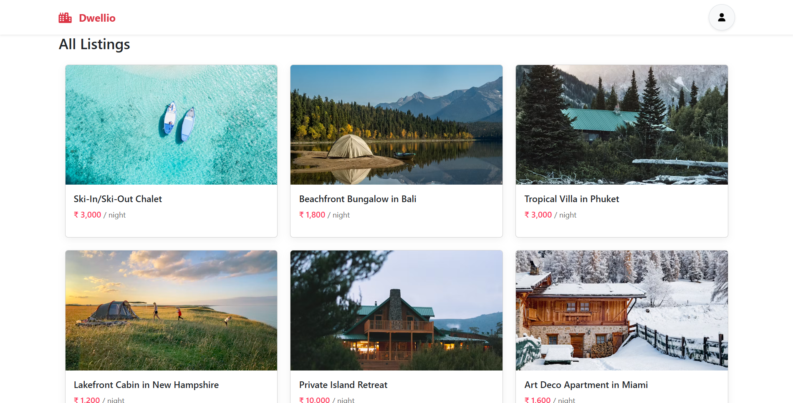
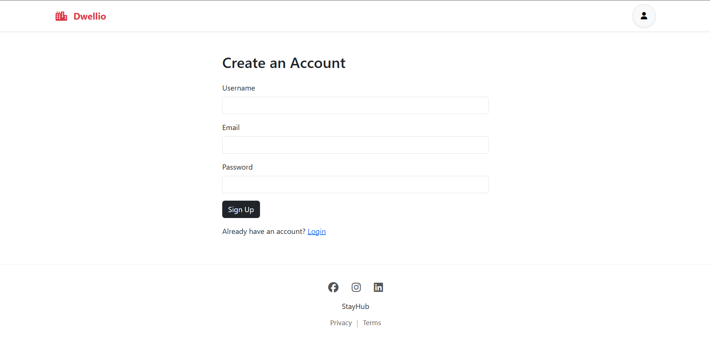
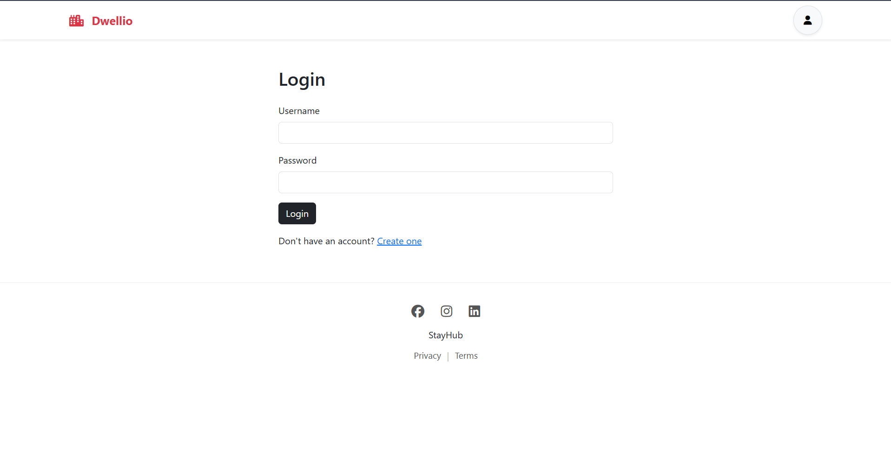
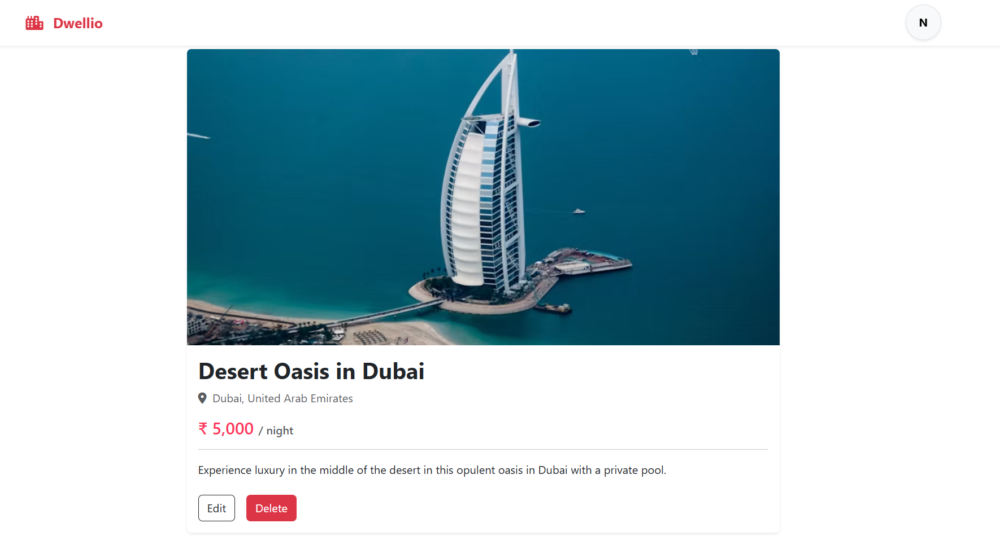
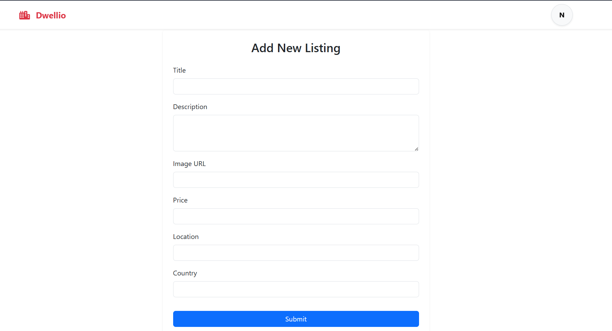
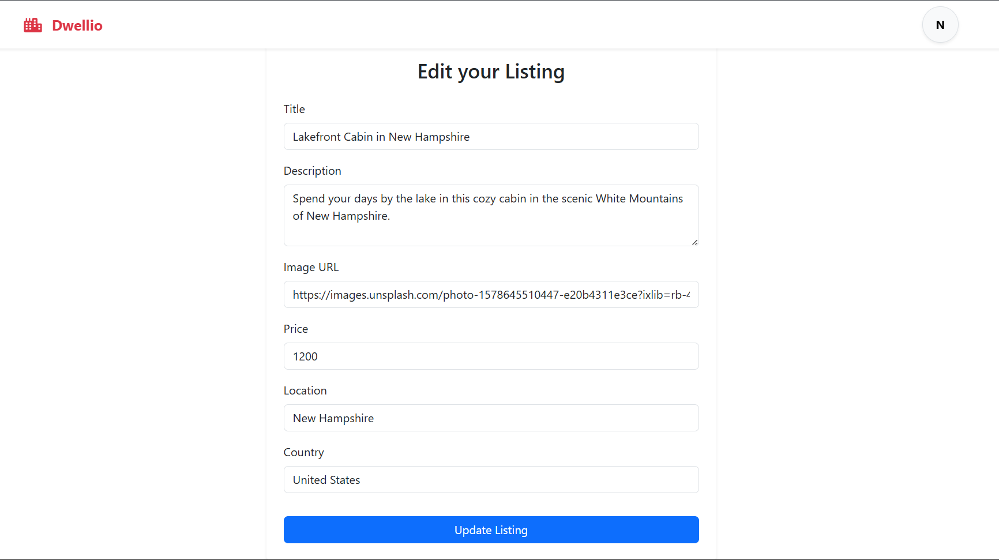
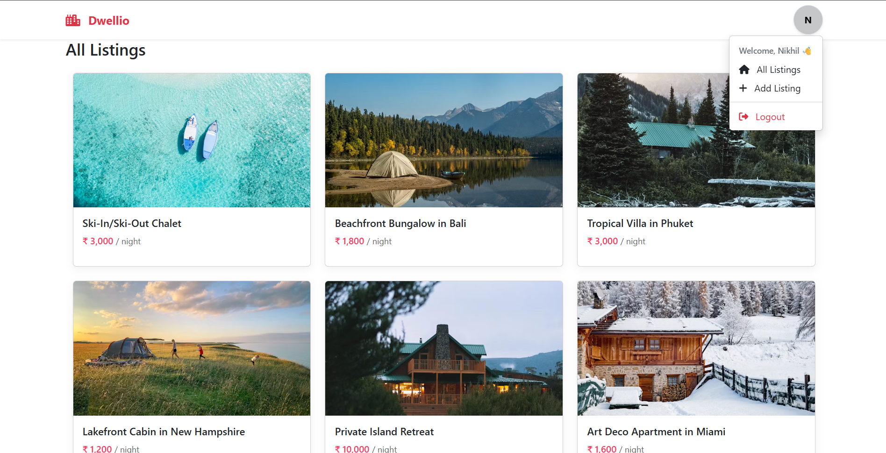

# 🏠 Dwellio

A modern full-stack accommodation booking platform inspired by Airbnb, allowing users to explore, create, update, and manage property listings through a clean and intuitive interface.

---

## 🚀 Live Demo

🔗 Live Demo: <YOUR_RENDER_LINK>

---

## ✨ Features

- User Registration & Login
- Authentication-based Navigation
- Browse Accommodation Listings
- View Detailed Listing Information
- Create New Listings
- Update Existing Listings
- Delete Listings
- Responsive Card-based User Interface
- Persistent Data Storage using MongoDB
- RESTful CRUD Operations

---

## 🛠️ Tech Stack

### Frontend
- HTML5
- CSS3
- Bootstrap 5
- EJS

### Backend
- Node.js
- Express.js

### Database
- MongoDB
- Mongoose

### Other Tools
- Git
- GitHub
- Render

---

# 📸 Application Workflow
## 🏡 Home Page

Browse all available accommodation listings displayed in a clean card-based layout with property images, pricing, and titles.

<p align="center">

</p>

## 👤 User Registration

New users can create an account to manage their own property listings.

<p align="center">

</p>

## 🔐 User Login

Existing users can securely log in to access personalized features.

<p align="center">

</p>

## 🏠 Listing Details

Each listing displays detailed property information including image, location, price, description, and management options.

<p align="center">

</p>

## ➕

Create New Listings

Authenticated users can add new accommodation listings by providing property details including title, image URL, location, pricing, and description.

<p align="center">

</p>

## ✏️

Update Existing Listings

Property owners can edit listing information at any time through an intuitive update form.

<p align="center">

</p>

## 👤 User Dashboard

After logging in, users can quickly access listing management options through a personalized navigation menu.

<p align="center">

</p>

## ⚙️ Installation

Clone the repository

```bash
git clone https://github.com/Nikhildev-17/Dwellio.git
```

Install dependencies

```bash
npm install
```

Create a `.env` file

```env
MONGO_URL=YOUR_MONGODB_CONNECTION_STRING
SESSION_SECRET=YOUR_SECRET
```

Run the application

```bash
npm start
```

Open

```
http://localhost:3000
```
## 📁 Project Structure

```
Dwellio
│
├── models/
├── routes/
├── views/
├── public/
├── middleware/
├── app.js
├── package.json
└── README.md
```

## 🚀 Future Enhancements

- Cloudinary Image Uploads
- Property Search & Filters
- Booking System
- Reviews & Ratings
- Google Maps Integration
- Payment Gateway
- Responsive Mobile Design

## 👨‍💻 Author

**Kommineni Venkata Nikhil**

GitHub: https://github.com/Nikhildev-17

LinkedIn: https://www.linkedin.com/in/venkata-nikhil-kommineni/
